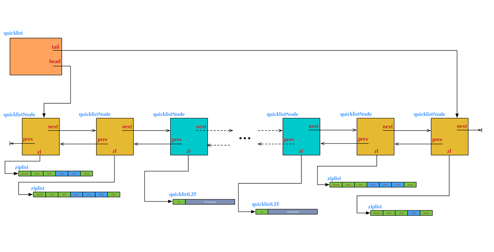

# Redis 基础系列（三）——列表对象

Redis 列表是简单的字符串列表，按照插入顺序进行排序，支持从头部或者尾部添加元素，因此列表对象也经常用作为队列。一个列表键最多可以含 2^32−1 个元素。

## 列表对象编码

Redis 列表对象的在 Redis3.0 之前编码是 ziplist 或者 linekedlist。ziplist 编码的底层结构为压缩列表；linkedlist 编码的底层为双端链表的数据结构。
现在的 Redis 的编码格式为 quicklist
如下为 ziplist 编码的列表对象示意图`

如下为 linkedlist 编码的列表对象示意图
注：链表中的每个节点是一个字符串对象，而不是一个简单的字符串。

Quicklist 结合了 ziplist 和 linkedlist 的机构

## 编码转换

当列表对象可以同时满足以下两个条件时， 列表对象使用 ziplist 编码：

- 列表对象保存的所有字符串元素的长度都小于 64 字节；

- 列表对象保存的元素数量小于 512 个；
  不能满足这两个条件的列表对象需要使用 linkedlist 编码。
  注：以上两个条件的上限值是可以修改的， 具体请看配置文件中关于 list-max-ziplist-value 选项和 list-max-ziplist-entries 选项的说明。

## 压缩列表（ziplist）

压缩列表是 Redis 为了节约内存而开发的, 由一系列特殊编码的连续内存块组成的顺序型数据结构。

### 1. 压缩列表构成

一个压缩列表可以包含任意多个节点(entry), 每个节点可以保存一个字节数组或者一个整数值。如下，展示了压缩列表的各个组成部分。

| **属性** | **类型** | **长度** | **用途**                                                                                                                                                                                          |
| -------- | -------- | -------- | ------------------------------------------------------------------------------------------------------------------------------------------------------------------------------------------------- |
| zlbytes  | uint32_t | 4 字节   | 记录整个压缩列表占用的内存字节数：在对压缩列表进行内存重分配， 或者计算 zlend 的位置时使用。                                                                                                      |
| zltail   | uint32_t | 4 字节   | 记录压缩列表表尾节点距离压缩列表的起始地址有多少字节： 通过这个偏移量，程序无须遍历整个压缩列表就可以确定表尾节点的地址。                                                                         |
| zllen    | uint16_t | 2 字节   | 记录了压缩列表包含的节点数量： 当这个属性的值小于 UINT16_MAX （65535）时， 这个属性的值就是压缩列表包含节点的数量； 当这个值等于 UINT16_MAX 时， 节点的真实数量需要遍历整个压缩列表才能计算得出。 |
| entryX   | 列表节点 | 不定     | 压缩列表包含的各个节点，节点的长度由节点保存的内容决定。                                                                                                                                          |
| zlend    | uint8_t  | 1 字节   | 特殊值 0xFF （十进制 255 ），用于标记压缩列表的末端。                                                                                                                                             |

### 2. 压缩列表节点的构成

每个压缩列表节点可以保存一个字节数组或者一个整数值

> 字节数组长度可以有以下 3 种
>
> - 长度小于等于 63（ 26−1）字节的字节数组；
> - 长度小于等于 16383 （214−1）字节的字节数组；
> - 长度小于等于 4294967295 （232−1）字节的字节数组；

> 整数值则可以有以下 6 种长度
>
> - 4 位长，介于 0 至 12 之间的无符号整数
> - 1 字节长的有符号整数
> - 3 字节长的有符号整数
> - int16_t 类型整数
> - int32_t 类型整数
> - int64_t 类型整数
>   每个压缩列表节点都由 previous_entry_length 、 encoding 、 content 三个部分组成。

### 3. 连锁更新

在一个压缩列表中， 有多个连续的、长度介于 250 字节到 253 字节之间的节点 e1 至 eN 。因为 e1 至 eN 的所有节点的长度都小于 254 字节， 所以记录这些节点的长度只需要 1 字节长的 previous_entry_length 属性， 换句话说， e1 至 eN 的所有节点的 previous_entry_length 属性都是 1 字节长的。
如果我们将一个长度大于等于 254 字节的新节点 new 设置为压缩列表的表头节点， 那么 new 将成为 e1 的前置节点，因为 e1 的 previous_entry_length 属性仅长 1 字节， 它没办法保存新节点 new 的长度， 所以程序将对压缩列表执行空间重分配操作， 并将 e1 节点的 previous_entry_length 属性从原来的 1 字节长扩展为 5 字节长。
现在， 麻烦的事情来了 —— e1 原本的长度介于 250 字节至 253 字节之间， 在为 previous_entry_length 属性新增四个字节的空间之后， e1 的长度就变成了介于 254 字节至 257 字节之间， 而这种长度使用 1 字节长的 previous_entry_length 属性是没办法保存的。
因此， 为了让 e2 的 previous_entry_length 属性可以记录下 e1 的长度， 程序需要再次对压缩列表执行空间重分配操作， 并将 e2 节点的 previous_entry_length 属性从原来的 1 字节长扩展为 5 字节长。
正如扩展 e1 引发了对 e2 的扩展一样， 扩展 e2 也会引发对 e3 的扩展， 而扩展 e3 又会引发对 e4 的扩展……为了让每个节点的 previous_entry_length 属性都符合压缩列表对节点的要求， 程序需要不断地对压缩列表执行空间重分配操作， 直到 eN 为止。
这就是连锁更新，因为一次操作，导致连续多次的空间扩展操作。除了添加节点会引发连锁更新，删除节点也是有可能引起连锁更新的。因为连锁更新在最坏情况下需要对压缩列表执行 N 次空间重分配操作， 而每次空间重分配的最坏复杂度为 O(N) ， 所以连锁更新的最坏复杂度为 O(N^2) 。
要注意的是， 尽管连锁更新的复杂度较高， 但它真正造成性能问题的几率是很低的：

- 首先， 压缩列表里要恰好有多个连续的、长度介于 250 字节至 253 字节之间的节点， 连锁更新才有可能被引发， 在实际中， 这种情况并不多见；
- 其次， 即使出现连锁更新， 但只要被更新的节点数量不多， 就不会对性能造成任何影响： 比如说， 对三五个节点进行连锁更新是绝对不会影响性能的；
  双端列表（linkedlist）

## QuickList

```c
/* Node, quicklist, and Iterator are the only data structures used currently. */

/* quicklistNode is a 32 byte struct describing a ziplist for a quicklist.
 * We use bit fields keep the quicklistNode at 32 bytes.
 * count: 16 bits, max 65536 (max zl bytes is 65k, so max count actually < 32k).
 * encoding: 2 bits, RAW=1, LZF=2.
 * container: 2 bits, NONE=1, ZIPLIST=2.
 * recompress: 1 bit, bool, true if node is temporary decompressed for usage.
 * attempted_compress: 1 bit, boolean, used for verifying during testing.
 * extra: 10 bits, free for future use; pads out the remainder of 32 bits */
typedef struct quicklistNode {
    struct quicklistNode *prev;
    struct quicklistNode *next;
    unsigned char *zl;
    unsigned int sz;             /* ziplist size in bytes */
    unsigned int count : 16;     /* count of items in ziplist */
    unsigned int encoding : 2;   /* RAW==1 or LZF==2 */
    unsigned int container : 2;  /* NONE==1 or ZIPLIST==2 */
    unsigned int recompress : 1; /* was this node previous compressed? */
    unsigned int attempted_compress : 1; /* node can't compress; too small */
    unsigned int extra : 10; /* more bits to steal for future usage */
} quicklistNode;

/* quicklistLZF is a 4+N byte struct holding 'sz' followed by 'compressed'.
 * 'sz' is byte length of 'compressed' field.
 * 'compressed' is LZF data with total (compressed) length 'sz'
 * NOTE: uncompressed length is stored in quicklistNode->sz.
 * When quicklistNode->zl is compressed, node->zl points to a quicklistLZF */
typedef struct quicklistLZF {
    unsigned int sz; /* LZF size in bytes*/
    char compressed[];
} quicklistLZF;

/* Bookmarks are padded with realloc at the end of of the quicklist struct.
 * They should only be used for very big lists if thousands of nodes were the
 * excess memory usage is negligible, and there's a real need to iterate on them
 * in portions.
 * When not used, they don't add any memory overhead, but when used and then
 * deleted, some overhead remains (to avoid resonance).
 * The number of bookmarks used should be kept to minimum since it also adds
 * overhead on node deletion (searching for a bookmark to update). */
typedef struct quicklistBookmark {
    quicklistNode *node;
    char *name;
} quicklistBookmark;

#if UINTPTR_MAX == 0xffffffff
/* 32-bit */
#   define QL_FILL_BITS 14
#   define QL_COMP_BITS 14
#   define QL_BM_BITS 4
#elif UINTPTR_MAX == 0xffffffffffffffff
/* 64-bit */
#   define QL_FILL_BITS 16
#   define QL_COMP_BITS 16
#   define QL_BM_BITS 4 /* we can encode more, but we rather limit the user
                           since they cause performance degradation. */
#else
#   error unknown arch bits count
#endif

/* quicklist is a 40 byte struct (on 64-bit systems) describing a quicklist.
 * 'count' is the number of total entries.
 * 'len' is the number of quicklist nodes.
 * 'compress' is: 0 if compression disabled, otherwise it's the number
 *                of quicklistNodes to leave uncompressed at ends of quicklist.
 * 'fill' is the user-requested (or default) fill factor.
 * 'bookmakrs are an optional feature that is used by realloc this struct,
 *      so that they don't consume memory when not used. */
typedef struct quicklist {
    quicklistNode *head;
    quicklistNode *tail;
    unsigned long count;        /* total count of all entries in all ziplists */
    unsigned long len;          /* number of quicklistNodes */
    int fill : QL_FILL_BITS;              /* fill factor for individual nodes */
    unsigned int compress : QL_COMP_BITS; /* depth of end nodes not to compress;0=off */
    unsigned int bookmark_count: QL_BM_BITS;
    quicklistBookmark bookmarks[];
} quicklist;
```



### ziplist

这里有两个 redis 的配置参数，list-max-ziplist-size 和 list-compress-depth，先来说第一个，既然快表是将链表跟压缩表数组结合起来使用，那么具体怎么用呢，比如我有一个 10 个元素的 list，那具体怎么放，每个 quicklistNode 里放多大的 ziplist，假如每个快表节点的 ziplist 只放一个元素，那么其实这就退化成了一个链表，如果 10 个元素放在一个 quicklistNode 的 ziplist 里，那就退化成了一个 ziplist，所以有了这个 list-max-ziplist-size,而且它还比较牛，能取正负值，当是正值时，对应的就是每个 quicklistNode 的 ziplist 中的元素个数，比如配置了 list-max-ziplist-size = 5，那么我刚才的 10 个元素的 list 就是一个两个 quicklistNode 组成的快表，每个 quicklistNode 中的 ziplist 包含了五个元素，当 list-max-ziplist-size 取负值的时候，它限制了 ziplist 的字节数

```c
REDIS_STATIC int _quicklistNodeSizeMeetsOptimizationRequirement(const size_t sz, const int fill) {
    if (fill >= 0)
        return 0;

    size_t offset = (-fill) - 1;
    if (offset < (sizeof(optimization_level) / sizeof(*optimization_level))) {
        if (sz <= optimization_level[offset]) {
            return 1;
        } else {
            return 0;
        }
    } else {
        return 0;
    }
}

/* Optimization levels for size-based filling */
static const size_t optimization_level[] = {4096, 8192, 16384, 32768, 65536};

/* Create a new quicklist.
 * Free with quicklistRelease(). */
quicklist *quicklistCreate(void) {
    struct quicklist *quicklist;

    quicklist = zmalloc(sizeof(*quicklist));
    quicklist->head = quicklist->tail = NULL;
    quicklist->len = 0;
    quicklist->count = 0;
    quicklist->compress = 0;
    quicklist->fill = -2;
    return quicklist;
}
```

这个 fill 就是传进来的 list-max-ziplist-size, 具体对应的就是

- -5: 每个 quicklist 节点上的 ziplist 大小不能超过 64 Kb。（注：1kb => 1024 bytes）
- -4: 每个 quicklist 节点上的 ziplist 大小不能超过 32 Kb。
- -3: 每个 quicklist 节点上的 ziplist 大小不能超过 16 Kb。
- -2: 每个 quicklist 节点上的 ziplist 大小不能超过 8 Kb。（-2 是 Redis 给出的默认值）也就是上面的 quicklist->fill = -2;
- -1: 每个 quicklist 节点上的 ziplist 大小不能超过 4 Kb。

### 压缩

list-compress-depth 这个参数是用来配置压缩的。这里考虑到的是一个场景，一般状况下，list 都是两端的访问频率比较高，那么是不是可以对中间的数据进行压缩，那么这个参数就是用来表示

```
/* depth of end nodes not to compress;0=off */
```

- 0，代表不压缩，默认值
- 1，两端各一个节点不压缩
- 2，两端各两个节点不压缩
- ... 依次类推

压缩后的 ziplist 就会变成 quicklistLZF，然后替换 zl 指针，这里使用的是 LZF 压缩算法，压缩后的 quicklistLZF 中的 compressed 也是个柔性数组，压缩后的 ziplist 整个就放进这个柔性数组
