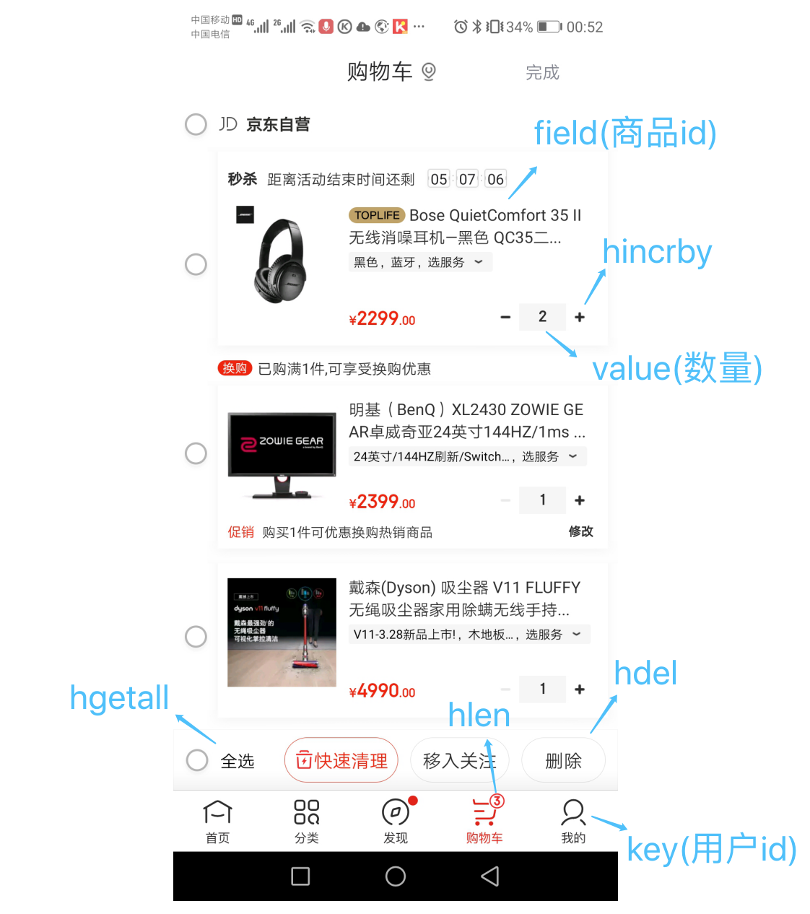

# Redis 基础系列（四）—— 哈希对象

在 Redis 中， 哈希类型是指键值本身又是一个键值对结构， 形如 value={{field1, value1}， ...{fieldN, valueN}}。Redis 中，每个哈希键可以存储键值对数量为 2 ^ 23 −1 个。

## 哈希对象编码

哈希对象内部编码有两种： `ziplist` 和 `hashtable` 。

- `ziplist` (压缩列表)：当哈希对象元素个数小于`hash-max-ziplist-entries`配置（默认为 512 个），同时所有值的长度小于 `hash-max-ziplist-value` 配置（默认为 64 字节）时，Redis 内部会使用 `ziplist`编码存储哈希对象。每当有新的键值对要加入到哈希对象时， 程序会先将保存了键的压缩列表节点推入到压缩列表表尾， 然后再将保存了值的压缩列表节点推入到压缩列表表尾。

  - 保存了同一键值对的两个节点总是紧挨在一起， 保存键的节点在前， 保存值的节点在后；
  - 先添加到哈希对象中的键值对会被放在压缩列表的表头方向， 而后来添加到哈希对象中的键值对会被放在压缩列表的表尾方向。

- `hashtable`（字典) ： 当哈希类型无法满足`ziplist`的条件时， Redis 会使用`hashtable`作为哈希的内部实现， 因为此时 ziplist 的读写效率会下降， 而`hashtable`的读写时间复杂度为 O(1).

## 字典(dict)

Redis 的字典使用哈希表作为底层实现，一个哈希表里面可以有多个哈希表节点，而每个哈希表节点就保存了字典中的每个健值。


### 代码实现

```c
typedef struct dict {
    // 类型特定函数
    dictType *type;
    // 私有数据
    void *privdata;
    // 哈希表  一般情况下， 字典只使用 ht[0] 哈希表，ht[1] 哈希表只会在对 ht[0] 哈希表进行 rehash 时使用。
    dictht ht[2];
    // rehash 索引，当 rehash 不在进行时，值为 -1
    long rehashidx; /* rehashing not in progress if rehashidx == -1 */
    // 当前运行的迭代位置
    unsigned long iterators; /* number of iterators currently running */
} dict;

typedef struct dictType {
    // 计算哈希值的函数
    uint64_t (*hashFunction)(const void *key);
    // 复制键的函数
    void *(*keyDup)(void *privdata, const void *key);
    // 复制值的函数
    void *(*valDup)(void *privdata, const void *obj);
    // 对比键的函数
    int (*keyCompare)(void *privdata, const void *key1, const void *key2);
    // 销毁键的函数
    void (*keyDestructor)(void *privdata, void *key);
    // 销毁值的函数
    void (*valDestructor)(void *privdata, void *obj);
} dictType;

/* This is our hash table structure. Every dictionary has two of this as we
 * implement incremental rehashing, for the old to the new table. */
typedef struct dictht {
    // 哈希表数组
    dictEntry **table;
    // 哈希表大小, 默认为 4
    unsigned long size;
    // 哈希表大小掩码，用于计算索引值，总是 size - 1
    unsigned long sizemask;
    // 哈希表已有节点的数量
    unsigned long used;
} dictht;

typedef struct dictEntry {
    // 键
    void *key;
    // 值
    union {
        void *val;
        uint64_t u64;
        int64_t s64;
        double d;
    } v;
    // 指向下个哈希表节点，形成链表
    struct dictEntry *next;
} dictEntry;
```

## 哈希算法

Redis 计算哈希值和索引值的方法如下：

```c
// 使用字典设置的哈希函数，计算键 key 的哈希值
hash = dict -> type -> hashFunction(key)
// 使用哈希表的 sizemask 属性和哈希值，计算出索引值(sizemask 为哈希表大小掩码，用于计算索引值，总是等于 size - 1)
// 根据情况不同，ht[x]可以是 ht[0]或者 ht[1]
index = hash & dict -> ht[x].sizemask
```

> 当字典被用作数据库的底层实现， 或者哈希键的底层实现时， Redis 使用 MurmurHash2 算法来计算键的哈希值。
>
> MurmurHash 算法最初由 Austin Appleby 于 2008 年发明， 这种算法的优点在于， 即使输入的键是有规律的， 算法仍能给出一个很好的随机分布性， 并且算法的计算速度也非常快。
>
> MurmurHash 算法目前的最新版本为 MurmurHash3 ， 而 Redis 使用的是 MurmurHash2 ， 关于 MurmurHash 算法的更多信息可以参考该算法的主页： http://code.google.com/p/smhasher/ 。

## 解决键冲突

当有两个或两个以上数量的键被分配到了哈希表数组的同一个索引上面时，我们称这些键发生了冲突。

- 解决哈希冲突的四种方法
  - 开放地址法
    - 线性探测法：在冲突的值上加上一个单位的值，直至不冲突。
    - 再平方探测法：在冲突的值上加上 1 的平方个单位，如果冲突则减去 1 的平方个单位；接着 2 的平方、3 的平方，直至不冲突。
    - 伪随机法：在冲突的值上加上一个随机数，直至不冲突。
  - 链式地址法：对冲突的的值使用功能链表方式存储
    - 处理方式简单，不会产生堆积现象，平均查找长度较短。
    - 链表节点可以随意扩展，适合无法确定长度的情况。
    - 相较于开放地址法，链式地址法更节省空间。
  - 建立公共溢出区：建立公共溢出区存储所有冲突的值。
  - 再哈希法：对于冲突的值再次使用哈希算法，直至不发生冲突。

Redis 使用链地址法解决键冲突，每个哈希表节点都有一个 next 指针，多个哈希表节点可以用 next 指针构成一个单向链表，被分配到同一个索引上的多个节点可以用这个单向链表连接起来，这就解决了键冲突的问题。

因为 dictEntry 节点组成的链表没有指向链表表尾的指针，所以为了速度考虑，程序总是将新节点添加到链表的表头位置。

```C
int dictAdd(dict *d, void *key, void *val)
{
    dictEntry *entry = dictAddRaw(d,key,NULL);

    if (!entry) return DICT_ERR;
    dictSetVal(d, entry, val);
    return DICT_OK;
}

dictEntry *dictAddRaw(dict *d, void *key, dictEntry **existing)
{
    long index;
    dictEntry *entry;
    dictht *ht;

    if (dictIsRehashing(d)) _dictRehashStep(d);

    /* Get the index of the new element, or -1 if
     * the element already exists. */
    if ((index = _dictKeyIndex(d, key, dictHashKey(d,key), existing)) == -1)
        return NULL;

    /* Allocate the memory and store the new entry.
     * Insert the element in top, with the assumption that in a database
     * system it is more likely that recently added entries are accessed
     * more frequently. */
    ht = dictIsRehashing(d) ? &d->ht[1] : &d->ht[0];
    entry = zmalloc(sizeof(*entry));
    entry->next = ht->table[index];
    ht->table[index] = entry;
    ht->used++;

    /* Set the hash entry fields. */
    dictSetKey(d, entry, key);
    return entry;
}
```

## rehash

随着操作的不断执行， 哈希表保存的键值对会逐渐地增多或者减少， 为了让哈希表的负载因子（load factor）维持在一个合理的范围之内， 当哈希表保存的键值对数量太多或者太少时， 程序需要对哈希表的大小进行相应的扩展或者收缩。

扩展和收缩哈希表的工作可以通过执行 rehash （重新散列）操作来完成， Redis 对字典的哈希表执行 rehash 的步骤如下：

1. 为字典的 ht[1] 哈希表分配空间， 这个哈希表的空间大小取决于要执行的操作， 以及 ht[0] 当前包含的键值对数量 （也即是 ht[0].used 属性的值）：
   - 如果执行的是扩展操作， 那么 ht[1] 的大小为第一个大于等于 ht[0].used \* 2 的 2 ^ n （2 的 n 次方幂）；
   - 如果执行的是收缩操作， 那么 ht[1] 的大小为第一个大于等于 ht[0].used 的 2^n 。
2. 将保存在 ht[0] 中的所有键值对 rehash 到 ht[1] 上面： rehash 指的是重新计算键的哈希值和索引值， 然后将键值对放置到 ht[1] 哈希表的指定位置上。
3. 当 ht[0] 包含的所有键值对都迁移到了 ht[1] 之后 （ht[0] 变为空表）， 释放 ht[0] ， 将 ht[1] 设置为 ht[0] ， 并在 ht[1] 新创建一个空白哈希表， 为下一次 rehash 做准备。

> 举个例子， 假设程序要对字典的 ht[0] 进行扩展操作， 那么程序将执行以下步骤：
>
> 1. ht[0].used 当前的值为 4 ， 4 \* 2 = 8 ， 而 8 （2^3）恰好是第一个大于等于 4 的 2 的 n 次方， 所以程序会将 ht[1] 哈希表的大小设置为 8 。
> 2. 将 ht[0] 包含的四个键值对都 rehash 到 ht[1]
> 3. 释放 ht[0] ，并将 ht[1] 设置为 ht[0] ，然后为 ht[1] 分配一个空白哈希表
>
> 至此， 对哈希表的扩展操作执行完毕， 程序成功将哈希表的大小从原来的 4 改为了现在的 8 。

- 哈希表的扩展条件

  - 服务器目前没有再执行 BGSAVE 命令或者 BGREWRITEAOF 命令, 并且哈希表的负载因子大于等于 1
  - 服务器目前正在执行 BGSAVE 命令或者 BGREWRITEAOF 命令, 并且哈希表的负载因子大于等于 5

  > 其中哈希表的负载因子可以通过公式：
  > load_factor = ht[0].used / ht[0].size

  > 根据 BGSAVE 命令或 BGREWRITEAOF 命令是否正在执行， 服务器执行扩展操作所需的负载因子并不相同， 这是因为在执行 BGSAVE 命令或 BGREWRITEAOF 命令的过程中， Redis 需要创建当前服务器进程的子进程， 而大多数操作系统都采用写时复制（copy-on-write）技术来优化子进程的使用效率， 所以在子进程存在期间， 服务器会提高执行扩展操作所需的负载因子， 从而尽可能地避免在子进程存在期间进行哈希表扩展操作， 这可以避免不必要的内存写入操作， 最大限度地节约内存。

- 哈希表的收缩条件

  - 当哈希表的负载因子小于 0.1 时，程序自动开始对哈希表执行收缩操作。

## 渐进式 rehash

扩展或收缩哈希表需要将 ht[0] 里面的所有键值对 rehash 到 ht[1] 里面，但是，这个 rehash 动作并不是一次性、集中式地完成的，而是分多次、渐进式地完成的。

这样做的原因在于，如果 ht[0] 里只保存着四个键值对，那么服务器可以在瞬间就将这些键值对全部 rehash 到 ht[1] ；但是，如果哈希表里保存的键值对数量不是四个，而是四百万、四千万甚至四亿个键值对， 那么要一次性将这些键值对全部 rehash 到 ht[1] 的话，庞大的计算量可能会导致服务器在一段时间内停止服务。

因此，为了避免 rehash 对服务器性能造成影响，服务器不是一次性将 ht[0] 里面的所有键值对全部 rehash 到 ht[1] ，而是分多次、渐进式地将 ht[0] 里面的键值对慢慢地 rehash 到 ht[1] 。

以下是哈希表渐进式 rehash 的详细步骤：

1. 为 ht[1] 分配空间， 让字典同时持有 ht[0] 和 ht[1] 两个哈希表。
2. 在字典中维持一个索引计数器变量 rehashidx ， 并将它的值设置为 0 ， 表示 rehash 工作正式开始。
3. 在 rehash 进行期间， 每次对字典执行添加、删除、查找或者更新操作时， 程序除了执行指定的操作以外， 还会顺带将 ht[0] 哈希表在 rehashidx 索引上的所有键值对 rehash 到 ht[1] ， 当 rehash 工作完成之后， 程序将 rehashidx 属性的值增一。
4. 随着字典操作的不断执行， 最终在某个时间点上， ht[0] 的所有键值对都会被 rehash 至 ht[1] ， 这时程序将 rehashidx 属性的值设为 -1 ， 表示 rehash 操作已完成。

渐进式 rehash 的好处在于它采取分而治之的方式， 将 rehash 键值对所需的计算工作均滩到对字典的每个添加、删除、查找和更新操作上， 从而避免了集中式 rehash 而带来的庞大计算量。

> ###### 渐进式 rehash 执行期间的哈希表操作
>
> 因为在进行渐进式 rehash 的过程中， 字典会同时使用 ht[0] 和 ht[1] 两个哈希表， 所以在渐进式 rehash 进行期间， 字典的删除（delete）、查找（find）、更新（update）等操作会在两个哈希表上进行： 比如说， 要在字典里面查找一个键的话， 程序会先在 ht[0] 里面进行查找， 如果没找到的话， 就会继续到 ht[1] 里面进行查找， 诸如此类。
>
> 另外， 在渐进式 rehash 执行期间， 新添加到字典的键值对一律会被保存到 ht[1] 里面， 而 ht[0] 则不再进行任何添加操作： 这一措施保证了 ht[0] 包含的键值对数量会只减不增， 并随着 rehash 操作的执行而最终变成空表。

## 业务场景

#### 购物车

以用户 id 为 key，商品 id 为 field，商品数量为 value，恰好构成了购物车的 3 个要素，如下图所示。



#### 存储对象

hash类型的(key, field, value)的结构与对象的(对象id, 属性, 值)的结构相似，也可以用来存储对象。

在介绍 string 类型的应用场景时有所介绍，string + json 也是存储对象的一种方式，那么存储对象时，到底用 string + json 还是用 hash 呢？

两种存储方式的对比如下表所示。

| | string + json | hash |
| --- | --- | --- |
| 效率 | 很高 | 高 |
| 容量 | 低 | 低 |
| 灵活性 | 低 | 高 |
| 序列化 | 简单 | 复杂 |

当对象的某个属性需要频繁修改时，不适合用 string+json，因为它不够灵活，每次修改都需要重新将整个对象序列化并赋值，如果使用 hash 类型，则可以针对某个属性单独修改，没有序列化，也不需要修改整个对象。比如，商品的价格、销量、关注数、评价数等可能经常发生变化的属性，就适合存储在 hash 类型里。

当然，不常变化的属性存储在 hash 类型里也没有问题，比如商品名称、商品描述、上市日期等。但是，当对象的某个属性不是基本类型或字符串时，使用 hash 类型就必须手动进行复杂序列化，比如，商品的标签是一个标签对象的列表，商品可领取的优惠券是一个优惠券对象的列表（如下图所示）等，即使以 coupons（优惠券）作为 field，value 想存储优惠券对象列表也还是要使用 json 来序列化，这样的话序列化工作就太繁琐了，不如直接用 string + json 的方式存储商品信息来的简单。

