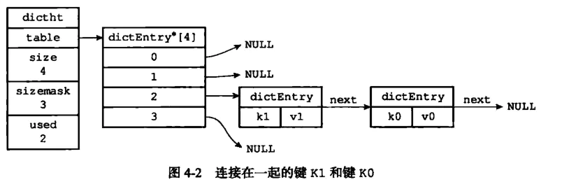

# Redis 基础系列（五）—— Set & ZSet

## Set

Redis**集合对象**的成员是唯一的，这就意味着集合中不能出现重复的数据。Redis 中**集合对象**的编码可以是`intset`或者`hashtable`，所以添加，删除，查找的复杂度都是 O(1)。集合中最大的成员数为

$$
2^{32} − 1
$$

### 编码的转换

当集合对象可以同时满足以下两个条件时， 对象使用 `intset` 编码：

- 集合对象保存的所有元素都是整数值；
- 集合对象保存的元素数量不超过 `512` 个（上限值是可以修改的， 具体请看配置文件中关于 `set-max-intset-entries` 选项说明）；

不能满足这两个条件的集合对象需要使用 `hashtable` 编码。

## ZSet

有序集合包含两个特性：**有序**、**元素不重复**。有序集合通过个每个元素设置一个分数（score），依据分数顺序实现元素有序（如下图）。虽然有序集合的元素不能重复，但是`score`可以重复。

### 编码的转换

当有序集合对象可以同时满足以下两个条件时， 对象使用 `ziplist` 编码：

- 有序集合保存的元素数量小于 `128` 个；
- 有序集合保存的所有元素成员的长度都小于 `64` 字节；

不能满足以上两个条件的有序集合对象将使用 `skiplist` 编码。

### 数据结构

#### ziplist 原理

压缩列表（ziplist）是 Redis 为了节省内存而开发的，是由一系列特殊编码的**连续内存块组成的顺序型数据结构**，一个压缩列表可以包含任意多个节点（entry），每个节点可以保存一个字节数组或者一个整数值。

- 每个节点组成如图。previous_entry_length 保存前一个节点的长度，遍历时可根据定位到前一个节点。encoding 存储 content 的类型和长度。content 保存节点的内容

#### 使用字典和跳跃表

```c
/* ZSETs use a specialized version of Skiplists */
typedef struct zskiplistNode {
    sds ele;
    double score;
    struct zskiplistNode *backward;
    struct zskiplistLevel {
        struct zskiplistNode *forward;
        unsigned long span;
    } level[];
} zskiplistNode;

typedef struct zskiplist {
    struct zskiplistNode *header, *tail;
    unsigned long length;
    int level;
} zskiplist;

typedef struct zset {
    dict *dict;
    zskiplist *zsl;
} zset;
```

字典的键保存元素的值，字典的值则保存元素的分值；跳跃表节点的 object 属性保存元素的值，跳跃表节点的 score 属性保存元素的分值。

###### 字典

字典中的键是唯一的，可以通过 key 来查找值

- 字典底层实现是哈希表，字典有两个哈希表，一个在扩容时使用，哈希表扩容使用渐进式扩容，发送扩容时需要在两个哈希表中进行搜索。



- 发生哈希冲突时使用链地址法解决

###### 跳跃表

跳跃表（skiplist）是一种有序数据结构，它通过在每个节点中维持多个指向其它节点的指针，从而达到快速访问节点的目的。


- 性质

  - 由很多层结构组成
  - 每一层都是一个有序的链表，排列顺序为由高层到底层，都至少包含两个链表节点，分别是前面的 head 节点和后面的 nil 节
  - 最底层的链表包含了所有的元素
  - 如果一个元素出现在某一层的链表中，那么在该层之下的链表也全都会出现（上一层的元素是当前层的元素的子集）
  - 链表中的每个节点都包含两个指针，一个指向同一层的下一个链表节点，另一个指向下一层的同一个链表节点；

- 操作

  - 搜索：从最高层的链表节点开始，如果比当前节点要大和比当前层的下一个节点要小，那么则往下找，也就是和当前层的下一层的节点的下一个节点进行比较，以此类推，一直找到最底层的最后一个节点，如果找到则返回，反之则返回空。
  - 插入：首先确定插入的层数，有一种方法是假设抛一枚硬币，如果是正面就累加，直到遇见反面为止，最后记录正面的次数作为插入的层数。当确定插入的层数 k 后，则需要将新元素插入到从底层到 k 层。
  - 删除：在各个层中找到包含指定值的节点，然后将节点从链表中删除即可，如果删除以后只剩下头尾两个节点，则删除这一层。

- 如何确定索引层的层高

  > 索引层的层高是由一个随机函数，幂次定律实现的

  ```c
  /* Returns a random level for the new skiplist node we are going to create.
   * The return value of this function is between 1 and ZSKIPLIST_MAXLEVEL
   * (both inclusive), with a powerlaw-alike distribution where higher
   * levels are less likely to be returned. */
  int zslRandomLevel(void) {
      int level = 1;
      while ((random()&0xFFFF) < (ZSKIPLIST_P * 0xFFFF))
          level += 1;
      return (level<ZSKIPLIST_MAXLEVEL) ? level : ZSKIPLIST_MAXLEVEL;
  }
  ```
