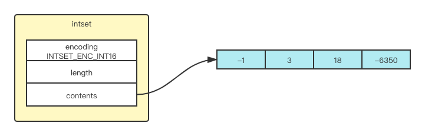

# Redis 基础系列（五）—— 集合对象

Redis**集合对象**的成员是唯一的，这就意味着集合中不能出现重复的数据。Redis 中**集合对象**的编码可以是`intset`或者`hashtable`，所以添加，删除，查找的复杂度都是 O(1)。集合中最大的成员数为
2 ^ 32 − 1

## 编码的转换

当集合对象可以同时满足以下两个条件时， 对象使用 `intset` 编码：

- 集合对象保存的所有元素都是整数值；
- 集合对象保存的元素数量不超过 `512` 个（上限值是可以修改的， 具体请看配置文件中关于 `set-max-intset-entries` 选项说明）；

不能满足这两个条件的集合对象需要使用 `hashtable` 编码。

## 存储结构

### 整数集合 (intset)

```c
typedef struct intset {
    // 编码方式
    uint32_t encoding;
    // 集合包含元素个数
    uint32_t length;
    // 保存元素的数组
    int8_t contents[];
} intset;
```

contents 数组是整数集合的底层实现： 整数集合的每个元素都是 contents 数组的一个数组项（item），各个项在数组中按值的大小从小到大有序地排列， 并且数组中不包含任何重复项。

length 属性记录了整数集合包含的元素数量， 也即是 contents 数组的长度。

虽然 intset 结构将 contents 属性声明为 int8_t 类型的数组， 但实际上 contents 数组并不保存任何 int8_t 类型的值 —— contents 数组的真正类型取决于 encoding 属性的值：

- 如果 encoding 属性的值为 INTSET_ENC_INT16 ， 那么 contents 就是一个 int16_t 类型的数组， 数组里的每个项都是一个 int16_t 类型的整数值 （最小值为 -32,768 ，最大值为 32,767 ）。
- 如果 encoding 属性的值为 INTSET_ENC_INT32 ， 那么 contents 就是一个 int32_t 类型的数组， 数组里的每个项都是一个 int32_t 类型的整数值 （最小值为 -2,147,483,648 ，最大值为 2,147,483,647 ）。
- 如果 encoding 属性的值为 INTSET_ENC_INT64 ， 那么 contents 就是一个 int64_t 类型的数组， 数组里的每个项都是一个 int64_t 类型的整数值 （最小值为 -9,223,372,036,854,775,808 ，最大值为 9,223,372,036,854,775,807 ）。



- encoding 属性的值为 INTSET_ENC_INT16 ， 表示整数集合的底层实现为 int16_t 类型的数组， 而集合保存的都是 int16_t 类型的整数值。
- length 属性的值为 5 ， 表示整数集合包含五个元素。
- contents 数组按从小到大的顺序保存着集合中的五个元素。
  因为每个集合元素都是 int16_t 类型的整数值， 所以 contents 数组的大小等于 sizeof(int16_t) _ 5 = 16 _ 5 = 80 位。

## 集合升级

每当我们要将一个新元素添加到整数集合里面， 并且新元素的类型比整数集合现有所有元素的类型都要长时， 整数集合需要先进行升级（upgrade）， 然后才能将新元素添加到整数集合里面。

升级整数集合并添加新元素共分为三步进行：

- 根据新元素的类型， 扩展整数集合底层数组的空间大小， 并为新元素分配空间。
- 将底层数组现有的所有元素都转换成与新元素相同的类型， 并将类型转换后的元素放置到正确的位上， 而且在放置元素的过程中， 需要继续维持底层数组的有序性质不变。
- 将新元素添加到底层数组里面。

> 因为每次向整数集合添加新元素都可能会引起升级， 而每次升级都需要对底层数组中已有的所有元素进行类型转换， 所以向整数集合添加新元素的时间复杂度为 O(N) 。

> ##### 升级之后新元素的摆放位置
> 
> 因为引发升级的新元素的长度总是比整数集合现有所有元素的长度都大， 所以这个新元素的值要么就大于所有现有元素， 要么就小于所有现有元素：
> 
> - 在新元素小于所有现有元素的情况下， 新元素会被放置在底层数组的最开头（索引 0 ）；
> - 在新元素大于所有现有元素的情况下， 新元素会被放置在底层数组的最末尾（索引 length-1 ）。

```c
static intset *intsetUpgradeAndAdd(intset *is, int64_t value) {
    uint8_t curenc = intrev32ifbe(is->encoding);
    uint8_t newenc = _intsetValueEncoding(value);
    int length = intrev32ifbe(is->length);
    int prepend = value < 0 ? 1 : 0;

    /* First set new encoding and resize */
    is->encoding = intrev32ifbe(newenc);
    is = intsetResize(is,intrev32ifbe(is->length)+1);

    /* Upgrade back-to-front so we don't overwrite values.
     * Note that the "prepend" variable is used to make sure we have an empty
     * space at either the beginning or the end of the intset. */
    while(length--)
        _intsetSet(is,length+prepend,_intsetGetEncoded(is,length,curenc));

    /* Set the value at the beginning or the end. */
    if (prepend)
        _intsetSet(is,0,value);
    else
        _intsetSet(is,intrev32ifbe(is->length),value);
    is->length = intrev32ifbe(intrev32ifbe(is->length)+1);
    return is;
}
```
### 升级的好处

- 提高灵活性

  因为 C 语言是静态类型语言， 为了避免类型错误， 我们通常不会将两种不同类型的值放在同一个数据结构里面。

  比如说， 我们一般只使用 int16_t 类型的数组来保存 int16_t 类型的值， 只使用 int32_t 类型的数组来保存 int32_t 类型的值， 诸如此类。

  但是， 因为整数集合可以通过自动升级底层数组来适应新元素， 所以我们可以随意地将 int16_t 、 int32_t 或者 int64_t 类型的整数添加到集合中， 而不必担心出现类型错误， 这种做法非常灵活。

- 节约内存

  当然， 要让一个数组可以同时保存 int16_t 、 int32_t 、 int64_t 三种类型的值， 最简单的做法就是直接使用 int64_t 类型的数组作为整数集合的底层实现。 不过这样一来， 即使添加到整数集合里面的都是 int16_t 类型或者 int32_t 类型的值， 数组都需要使用 int64_t 类型的空间去保存它们， 从而出现浪费内存的情况。

  而整数集合现在的做法既可以让集合能同时保存三种不同类型的值， 又可以确保升级操作只会在有需要的时候进行， 这可以尽量节省内存。

  比如说， 如果我们一直只向整数集合添加 int16_t 类型的值， 那么整数集合的底层实现就会一直是 int16_t 类型的数组， 只有在我们要将 int32_t 类型或者 int64_t 类型的值添加到集合时， 程序才会对数组进行升级。


## 业务场景

#### 标签、点赞、收藏

给用户打上感兴趣的标签，然后就能知道相同不同用户拥有相互爱好的群体；

#### 公共好友、关注模型

一个人的好友，这样的话就能知道共同拥有的好友；

#### 筛选操作