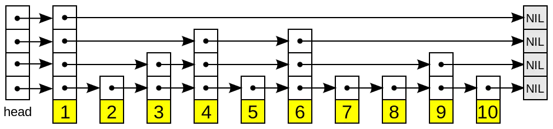

# Redis 基础系列（六）—— 有序集合对象

有序集合包含两个特性：**有序**、**元素不重复**。有序集合通过个每个元素设置一个分数（score），依据分数顺序实现元素有序（如下图）。虽然有序集合的元素不能重复，但是`score`可以重复。

## 编码的转换

当有序集合对象可以同时满足以下两个条件时， 对象使用 `ziplist` 编码：

- 有序集合保存的元素数量小于 `128` 个；
- 有序集合保存的所有元素成员的长度都小于 `64` 字节；
- 当ziplist作为zset的底层存储结构时候，每个集合元素使用两个紧挨在一起的压缩列表节点来保存，第一个节点保存元素的成员，第二个元素保存元素的分值。

不能满足以上两个条件的有序集合对象将使用 `skiplist` 编码。

## 数据结构

#### 跳跃表 (skiplist)

跳跃表（skiplist）是一种有序数据结构，它通过在每个节点中维持多个指向其它节点的指针，从而达到快速访问节点的目的。



- 性质
  - 由很多层结构组成
  - 每一层都是一个有序的链表，排列顺序为由高层到底层，都至少包含两个链表节点，分别是前面的 head 节点和后面的 nil 节
  - 最底层的链表包含了所有的元素
  - 如果一个元素出现在某一层的链表中，那么在该层之下的链表也全都会出现（上一层的元素是当前层的元素的子集）
  - 链表中的每个节点都包含两个指针，一个指向同一层的下一个链表节点，另一个指向下一层的同一个链表节点；

- 操作
  - 搜索：从最高层的链表节点开始，如果比当前节点要大和比当前层的下一个节点要小，那么则往下找，也就是和当前层的下一层的节点的下一个节点进行比较，以此类推，一直找到最底层的最后一个节点，如果找到则返回，反之则返回空。
  - 插入：首先确定插入的层数，有一种方法是假设抛一枚硬币，如果是正面就累加，直到遇见反面为止，最后记录正面的次数作为插入的层数。当确定插入的层数 k 后，则需要将新元素插入到从底层到 k 层。
  - 删除：在各个层中找到包含指定值的节点，然后将节点从链表中删除即可，如果删除以后只剩下头尾两个节点，则删除这一层。


### Redis 中使用的跳跃表 (zskiplist)

#### 概括

Redis 的跳跃表由 redis.h/zskiplistNode 和 redis.h/zskiplist 两个结构定义， 其中 zskiplistNode 结构用于表示跳跃表节点， 而 zskiplist 结构则用于保存跳跃表节点的相关信息， 比如节点的数量， 以及指向表头节点和表尾节点的指针等等。
 
```c
/* ZSETs use a specialized version of Skiplists */
typedef struct zskiplistNode {
    // 成员对象
    sds ele;
    // 分值
    double score;
    // 后退指针
    struct zskiplistNode *backward;
    // 层级
    struct zskiplistLevel {
        // 前进指针
        struct zskiplistNode *forward;
        // 跨度
        unsigned long span;
    } level[];
} zskiplistNode;

typedef struct zskiplist {
    struct zskiplistNode *header, *tail;
    unsigned long length;
    int level;
} zskiplist;

typedef struct zset {
    dict *dict;
    zskiplist *zsl;
} zset;
```


如图展示了一个跳跃表示例，位于图片最左边的是 zskiplist 结构， 该结构包含以下属性：
- header ：指向跳跃表的表头节点。
- tail ：指向跳跃表的表尾节点。
- level ：记录目前跳跃表内，层数最大的那个节点的层数（表头节点的层数不计算在内）。
- length ：记录跳跃表的长度，也即是，跳跃表目前包含节点的数量（表头节点不计算在内）。

位于 zskiplist 结构右方的个 zskiplistNode 结构， 该结构包含以下属性：
- 层（level）：每个层都带有两个属性：前进指针和跨度。前进指针用于访问位于表尾方向的其他节点，而跨度则记录了前进指针所指向节点和当前节点的距离。当程序从表头向表尾进行遍历时，访问会沿着层的前进指针进行。
- 后退（backward）指针：节点中用 BW 字样标记节点的后退指针，它指向位于当前节点的前一个节点。后退指针在程序从表尾向表头遍历时使用。
- 分值（score）：各个节点中的 1.0 、 2.0 和 3.0 是节点所保存的分值。在跳跃表中，节点按各自所保存的分值从小到大排列。
- 成员对象（ele）：各个节点中的 o1 、 o2 和 o3 是节点所保存的成员对象。
注意表头节点和其他节点的构造是一样的： 表头节点也有后退指针、分值和成员对象， 不过表头节点的这些属性都不会被用到，所以图中省略了这些部分， 只显示了表头节点的各个层。

#### 跳跃表节点 (zskiplistNode)

##### 层

跳跃表节点的 level 数组可以包含多个元素， 每个元素都包含一个指向其他节点的指针， 程序可以通过这些层来加快访问其他节点的速度，一般来说，层的数量越多，访问其他节点的速度就越快。

每次创建一个新跳跃表节点的时候，程序都根据幂次定律(power law，越大的数出现的概率越小)随机生成一个介于 1 和 32 之间的值作为 level 数组的大小， 这个大小就是层的“高度”。
```c
/* Returns a random level for the new skiplist node we are going to create.
 * The return value of this function is between 1 and ZSKIPLIST_MAXLEVEL
 * (both inclusive), with a powerlaw-alike distribution where higher
 * levels are less likely to be returned. */
int zslRandomLevel(void) {
    int level = 1;
    while ((random()&0xFFFF) < (ZSKIPLIST_P * 0xFFFF))
        level += 1;
    return (level<ZSKIPLIST_MAXLEVEL) ? level : ZSKIPLIST_MAXLEVEL;
}
```

##### 前进指针

每个层都有一个指向表尾方向的前进指针（level[i].forward 属性）， 用于从表头向表尾方向访问节点。

图 5-3 用虚线表示出了程序从表头向表尾方向， 遍历跳跃表中所有节点的路径：

- 迭代程序首先访问跳跃表的第一个节点（表头）， 然后从第四层的前进指针移动到表中的第二个节点。
- 在第二个节点时， 程序沿着第二层的前进指针移动到表中的第三个节点。
- 在第三个节点时， 程序同样沿着第二层的前进指针移动到表中的第四个节点。
- 当程序再次沿着第四个节点的前进指针移动时， 它碰到一个 NULL ， 程序知道这时已经到达了跳跃表的表尾， 于是结束这次遍历。

##### 跨度
层的跨度（level[i].span 属性）用于记录两个节点之间的距离：

两个节点之间的跨度越大， 它们相距得就越远。
指向 NULL 的所有前进指针的跨度都为 0 ， 因为它们没有连向任何节点。
初看上去， 很容易以为跨度和遍历操作有关， 但实际上并不是这样一一遍历操作只使用前进指针就可以完成了， 跨度实际上是用来计算排位（rank）的： 在查找某个节点的过程中， 将沿途访问过的所有层的跨度累计起来， 得到的结果就是目标节点在跳跃表中的排位。

##### 后退指针
节点的后退指针（backward 属性）用于从表尾向表头方向访问节点： 跟可以一次跳过多个节点的前进指针不同， 因为每个节点只有一个后退指针， 所以每次只能后退至前一个节点。

##### 分值和成员

节点的分值（score 属性）是一个 double 类型的浮点数， 跳跃表中的所有节点都按分值从小到大来排序。

节点的成员对象（ele 属性）是一个SDS的字符串对象。

在同一个跳跃表中， 各个节点保存的成员对象必须是唯一的， 但是多个节点保存的分值却可以是相同的： 分值相同的节点将按照成员对象在字典序中的大小来进行排序， 成员对象较小的节点会排在前面（靠近表头的方向）， 而成员对象较大的节点则会排在后面（靠近表尾的方向）。

## 业务场景

#### 延迟队列

zset 会按 score 进行排序，如果 score 代表想要执行时间的时间戳。在某个时间将它插入zset集合中，它变会按照时间戳大小进行排序，也就是对执行时间前后进行排序。

起一个死循环线程不断地进行取第一个key值，如果当前时间戳大于等于该key值的score就将它取出来进行消费删除，可以达到延时执行的目的。


#### 实时排行榜

经常浏览技术社区的话，应该对 “1小时最热门” 这类榜单不陌生。如何实现呢？如果记录在数据库中，不太容易对实时统计数据做区分。我们以当前小时的时间戳作为 zset 的 key，把贴子ID作为 member ，点击数评论数等作为 score，当 score 发生变化时更新 score。利用 ZREVRANGE 或者 ZRANGE 查到对应数量的记录。

#### 限流

滑动窗口是限流常见的一种策略。如果我们把一个用户的 ID 作为 key 来定义一个 zset ，member 或者 score 都为访问时的时间戳。我们只需统计某个 key 下在指定时间戳区间内的个数，就能得到这个用户滑动窗口内访问频次，与最大通过次数比较，来决定是否允许通过。

